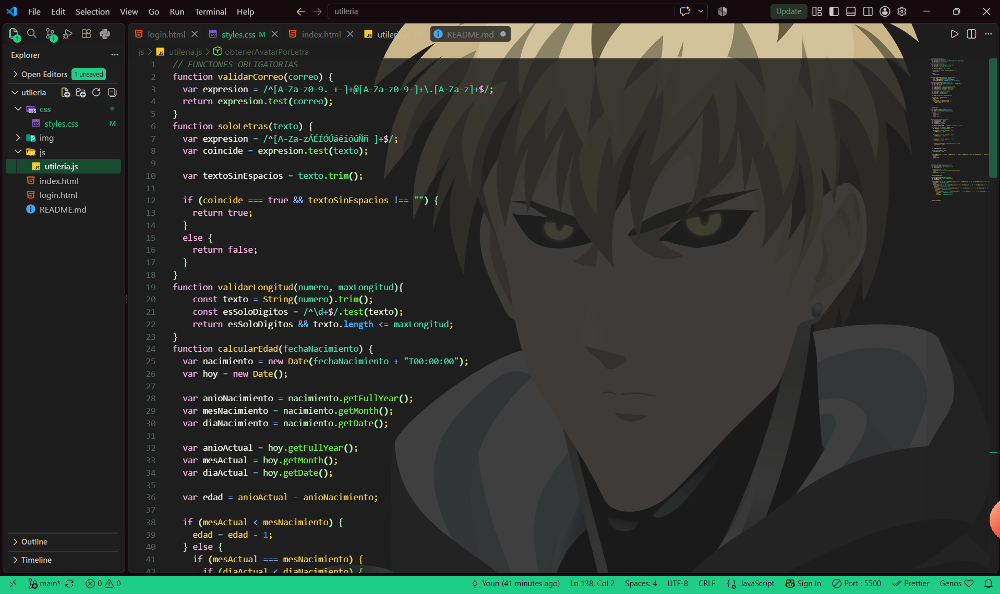
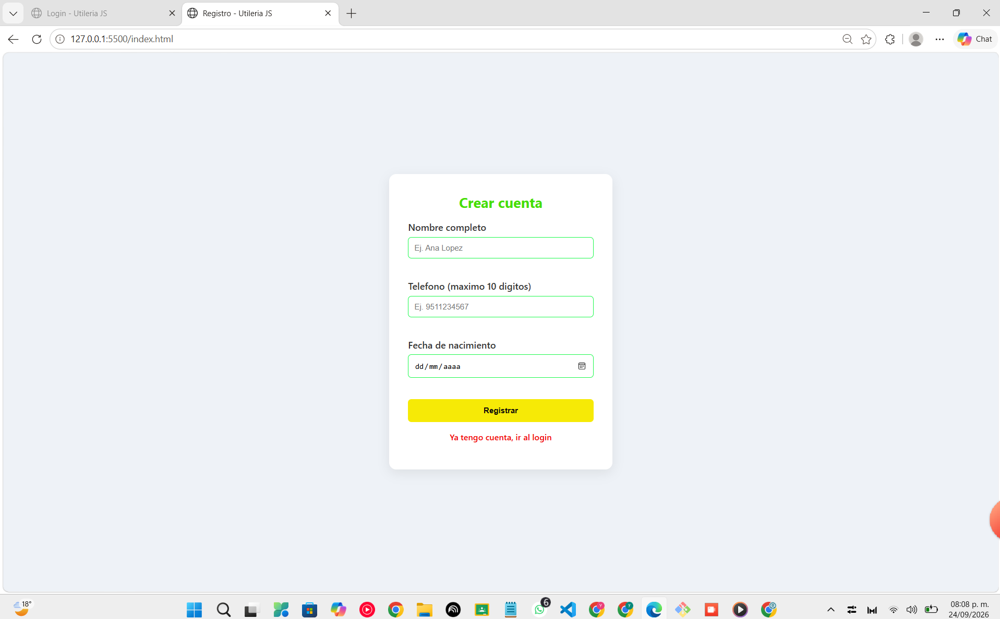

# utileria.js

## Portada

**Autor:** <Tu Nombre Completo>

**¿Qué problema resuelve?**
`utileria.js` es una librería de JavaScript, escrita sin frameworks ni dependencias externas, que centraliza las validaciones más comunes de un formulario web: correo electrónico, contraseñas seguras, textos con solo letras, longitud de números, y cálculo de edad a partir de una fecha de nacimiento. En vez de repetir esta lógica en cada proyecto, esta librería se puede incluir con una sola línea y reutilizar en cualquier formulario, modal o página de login.

Además, incluye dos funciones propias que resuelven un problema adicional: identificar al usuario a partir de su correo y asignarle un avatar visual automáticamente, sin necesidad de que suba una foto.

---

## Instalación

Copia el archivo `utileria.js` dentro de la carpeta `js` de tu proyecto, y agrega esta línea antes de cerrar la etiqueta `</body>` de tu HTML:

```html
<script src="js/utileria.js"></script>
```

A partir de ahí, todas las funciones de la librería quedan disponibles para usarse en cualquier `<script>` que se cargue después de esta línea.

---

## Uso

### validarCorreo(correo)

Valida si un texto tiene el formato de un correo electrónico.

```javascript
validarCorreo("ana@gmail.com"); // true
validarCorreo("correo-invalido");  // false
```

### soloLetras(texto)

Valida que un texto contenga solo letras (incluye acentos, la ñ, y espacios).

```javascript
soloLetras("Ana Lopez"); // true
soloLetras("Ana123");    // false
```

### validarLongitud(numero, maxLongitud)

Valida que un número no exceda una cantidad máxima de dígitos.

```javascript
validarLongitud("9511234567", 10); // true
validarLongitud("12345678901", 10); // false
```

### calcularEdad(fechaNacimiento)

Calcula la edad exacta en años a partir de una fecha de nacimiento en formato `"AAAA-MM-DD"`.

```javascript
calcularEdad("2000-05-15"); // por ejemplo, 26
```

### esMayorDeEdad(fechaNacimiento)

Valida si una persona es mayor de edad (18 años o más).

```javascript
esMayorDeEdad("2010-01-01"); // false
esMayorDeEdad("2000-01-01"); // true
```

### validarPassword(password)

Valida que una contraseña tenga mínimo 8 caracteres, con al menos una mayúscula, una minúscula, un número y un carácter especial.

```javascript
validarPassword("Clave123!");   // true
validarPassword("clave123");    // false
```

### obtenerNombreDeUsuario(correo) — función propia

Extrae el nombre de usuario de un correo electrónico, es decir, el texto que está antes del símbolo `@`.

```javascript
obtenerNombreDeUsuario("ana@gmail.com"); // "ana"
```

### obtenerAvatarPorLetra(letra) — función propia

Asigna la ruta de una imagen de avatar según la primera letra de un nombre de usuario, dividiendo el abecedario en 5 grupos de letras.

```javascript
obtenerAvatarPorLetra("a"); // "img/avatar1.png"
obtenerAvatarPorLetra("m"); // "img/avatar3.png"
```

---

## Capturas de pantalla

Abre la consola del navegador (tecla F12 → pestaña *Console*) y ejecuta ahí las funciones de ejemplo de arriba, para capturar los resultados `true`/`false` impresos en consola.






---

## Demo en vivo

<https://youri22-eng.github.io/Actividad2_utileria.js/>

---

## Video

Video demo de máximo 1 minuto mostrando el problema que resuelve la librería, cómo se usa, y el resultado en acción:

[Ver video demo](<https://youtu.be/DMyyHhDPCFE>)